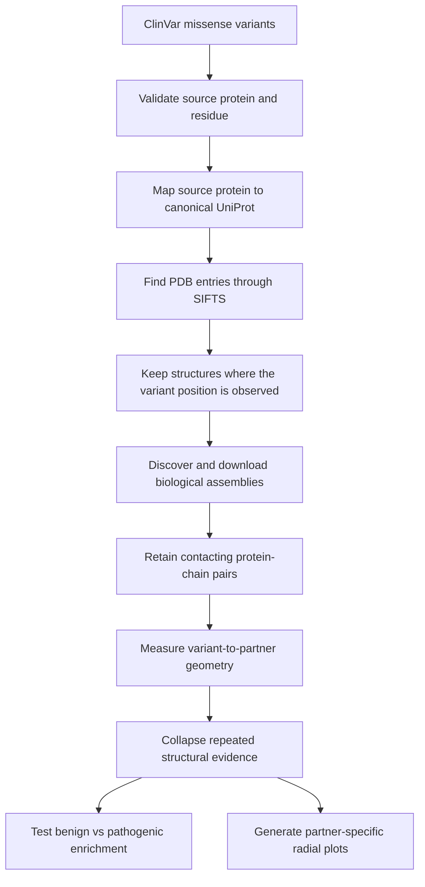

# Full ClinVar Protein-Interface Analysis

This project asks a simple question:

> Are pathogenic ClinVar missense variants more likely than benign variants to occur at protein-protein interfaces?

To answer it, the pipeline maps each ClinVar amino-acid substitution to a canonical UniProt protein, finds experimental PDB structures containing that residue, reconstructs biological assemblies, identifies contacting protein-chain pairs, calculates whether the residue lies at an interface, removes repeated structural evidence, and finally compares benign and pathogenic variants statistically.

The completed run started from **252,767 ClinVar variants** and produced a final reference-covered analysis set of **62,005 variants**. Pathogenic variants were more frequently observed at interfaces than benign variants, including after protein-level and evidence-level adjustment.

---

## Contents

- [1. Main result](#1-main-result)
- [2. What the pipeline does](#2-what-the-pipeline-does)
- [3. Important terminology](#3-important-terminology)
- [4. Project layout](#4-project-layout)
- [5. Compute and environment setup](#5-compute-and-environment-setup)
- [6. Required input data](#6-required-input-data)
- [7. Running the pipeline](#7-running-the-pipeline)
- [8. Detailed explanation of each stage](#8-detailed-explanation-of-each-stage)
- [9. Output files](#9-output-files)
- [10. Completed-run numbers](#10-completed-run-numbers)
- [11. Statistical interpretation](#11-statistical-interpretation)
- [12. Radial interface plots](#12-radial-interface-plots)
- [13. Quality checks](#13-quality-checks)
- [14. Common failures and fixes](#14-common-failures-and-fixes)
- [15. Limitations](#15-limitations)
- [16. Recommended next analyses](#16-recommended-next-analyses)

---

## 1. Main result

Among variants with valid reference-residue coverage in at least one retained structure:

| Interface definition | Pathogenic at interface | Benign at interface | Unadjusted odds ratio | Protein-stratified CMH OR |
|---|---:|---:|---:|---:|
| Backbone within 10 Å | 47.45% | 38.69% | 1.431 | 1.334 |
| Heavy atom within 5 Å | 34.19% | 26.40% | 1.448 | 1.267 |
| Either definition | 48.28% | 39.47% | 1.432 | 1.329 |

For the union definition, the conditional logistic model gave an adjusted odds ratio of:

**OR = 1.328, 95% CI 1.249–1.411, p = 8.69 × 10⁻²⁰**

The model adjusted for:

- protein identity;
- number of supporting PDB entries;
- number of distinct partner contexts; and
- ClinVar review stars.

Plain-language interpretation: within the structurally covered analysis set, a variant at a protein interface had approximately **33% higher odds of being pathogenic** after these adjustments. This is an association, not proof that the interface location caused pathogenicity.

---

## 2. What the pipeline does



The pipeline uses experimental structures rather than treating a protein as a single abstract sequence. A single protein may appear in many PDB entries, assemblies, chains, and interaction contexts. The workflow therefore preserves the detailed evidence first and collapses it only near the end.

Three denominators must be kept separate:

| Denominator | Count | Meaning |
|---|---:|---|
| Full ClinVar input | 252,767 | All benchmark variants entering this extension |
| UniProt-ready | 233,636 | Variants mapped to a canonical UniProt coordinate |
| SIFTS-mapped | 74,973 | Variants with an observed residue mapping in at least one PDB chain |
| Contacting-pair coverage | 62,211 | Variants on a target chain with at least one retained partner chain |
| Final reference-covered | 62,005 | Variants whose PDB residue agrees with the ClinVar reference amino acid |

Variants excluded because no suitable structure exists must **not** be counted as non-interface variants.

---

## 3. Important terminology

### ClinVar variant

A clinically interpreted DNA change. This project uses missense variants, where one amino acid in the encoded protein is replaced by another.

### Source protein

The protein sequence and position attached to the original ClinVar annotation, usually through an Ensembl protein identifier.

### Canonical UniProt protein

The stable protein coordinate system used to connect ClinVar, SIFTS, and PDB data. Isoform positions are aligned and lifted to canonical coordinates when possible.

### PDB entry

An experimental structure deposited in the Protein Data Bank. One PDB entry may contain multiple models, chains, ligands, or assemblies.

### Biological assembly

The biologically relevant complex proposed by the structure authors or database annotation. This is preferable to using the asymmetric unit directly because the asymmetric unit is mainly a crystallographic storage unit.

### SIFTS

SIFTS provides residue-level mappings between PDB chains and external sequence databases such as UniProt. Here it connects a canonical UniProt residue to a residue observed in a PDB structure.

### Target and partner chains

The **target chain** carries the ClinVar variant. A **partner chain** is another protein chain in the same biological assembly that passes the contact filter.

### Interface definitions

Two definitions are retained:

1. **Pinder-like 10 Å rule:** at least one target/partner backbone-atom pair is within 10 Å.
2. **Heavy-atom 5 Å rule:** at least one non-hydrogen target/partner atom pair is within 5 Å.

The principal analysis uses their union:

```text
union_interface = pinder_interface_10A OR heavy_interface_5A
```

The 10 Å rule is broader. The 5 Å rule is stricter chemically, but it can recover a small number of contacts missed by a backbone-only screen.

### Homomeric and heteromeric

- **Homomeric:** target and partner represent the same protein.
- **Heteromeric:** target and partner represent different proteins.
- **Both:** the residue is supported in both types of interaction context.

---

## 4. Project layout

The completed project uses fast local storage for the Conda environment and the larger NFS mount for data and scripts.

```text
/path/to/
└── conda_envs/
    └── clinvar_interface_full/       # Conda environment; close to compute

/path/to/root
├── data/
│   ├── raw/                          # ClinVar, FASTA, SIFTS and manifests
│   └── processed/
│       ├── source_validation/
│       ├── uniprot_mapping/
│       ├── uniprot_ready/
│       ├── structure_discovery/
│       ├── assembly_discovery/
│       ├── chain_pairs/
│       ├── variant_structure_mapping/
│       ├── variant_pair_tasks/
│       ├── variant_geometry/
│       ├── interface_mapping/
│       └── interface_catalog/
├── structures/
│   └── assemblies/                   # Downloaded *.cif.gz biological assemblies
├── scripts/                          # Numbered pipeline scripts
├── logs/                             # One log per stage
├── results/
│   ├── interface_enrichment/
│   └── full_clinvar_radial/
└── plots/
    └── full_clinvar_radial/
```

The earlier `scripts.zip` belongs to the approximately 7,000-variant prototype. It should not be substituted for the full-run scripts described here.

---

## 5. Compute and environment setup

### 5.1 Shell variables

Run these when opening a new terminal:

```bash
export IF_PROJECT=/path/to/root/clinvar_interface_full
export IF_ENV=/path/to/conda/env/
export IF_TEMP=/path/to/temp/folder/

source "$IF_ENV/bin/activate"
cd "$IF_PROJECT"
mkdir -p logs
```

Optional cache redirection:

```bash
export CONDA_PKGS_DIRS=/path/to/conda/pkgs
export PIP_CACHE_DIR=/path/to/pip/cache
export TMPDIR=/path/to/tmp_folder
mkdir -p "$CONDA_PKGS_DIRS" "$PIP_CACHE_DIR" "$TMPDIR"
```

### 5.2 Core Python dependencies

The full run used Python 3.11. The main packages are:

```bash
python -m pip install \
  numpy pandas pyarrow scipy biopython requests tqdm \
  gemmi duckdb statsmodels matplotlib seaborn
```

Record the environment after a successful run:

```bash
conda env export --prefix "$IF_ENV" > "$IF_PROJECT/environment.yml"
python -m pip freeze > "$IF_PROJECT/requirements-lock.txt"
```

### 5.3 Long-running stages

Use `tmux` for assembly downloads, parsing, and geometry calculation:

```bash
tmux new -s clinvar-interface
```

Detach with `Ctrl-b d` and return with:

```bash
tmux attach -t clinvar-interface
```

---

## 6. Required input data

The scripts expect the following logical inputs. Exact filenames may differ, so check path constants or command-line arguments in the scripts before starting.

| Input | Purpose | Completed-run size/count |
|---|---|---:|
| ClinVar missense benchmark table | Variant labels and protein annotations | 252,767 rows |
| Source protein FASTA | Validate original sequences and amino-acid positions | 24,738 sequences |
| Human UniProt FASTA | Canonical and isoform sequence matching | 169,637 sequences |
| SIFTS PDB–UniProt mappings | Connect UniProt residues to observed PDB residues | 329,154 candidate segments initially |
| RCSB GraphQL API | Entry metadata and biological assemblies | 56,502 relevant PDB entries queried |
| RCSB assembly mmCIF files | Atomic coordinates used for contact geometry | 42,833 retained assemblies |

Expected ClinVar fields include:

```text
variant_id, chrom, pos, ref, alt, label, label_name,
review_stars, gene_symbol, protein_id, protein_sequence_id,
swissprot, trembl, uniprot_isoform, protein_position,
aa_ref, aa_alt, mutation, protein_length
```

Before the full run, verify:

```bash
test -d "$IF_PROJECT/scripts"
test -d "$IF_PROJECT/data"
test -w "$IF_PROJECT/logs"
python -c "import pandas, pyarrow, gemmi, scipy; print('environment OK')"
```

---

## 7. Running the pipeline

The commands below assume every script uses the project paths configured during the completed run.

### 7.1 Reusable command pattern

```bash
python "$IF_PROJECT/scripts/SCRIPT.py" \
  2>&1 | tee "$IF_PROJECT/logs/STAGE.log"
```

With `set -o pipefail`, the shell also reports a Python failure correctly when output is piped through `tee`:

```bash
set -o pipefail
```

### 7.2 Mapping and structure-discovery stages

```bash
python "$IF_PROJECT/scripts/01_validate_source_sequences.py" \
  2>&1 | tee "$IF_PROJECT/logs/01_validate_source_sequences.log"

python "$IF_PROJECT/scripts/02_build_uniprot_candidates.py" \
  2>&1 | tee "$IF_PROJECT/logs/02_build_uniprot_candidates.log"

python "$IF_PROJECT/scripts/03_match_uniprot_sequences.py" \
  2>&1 | tee "$IF_PROJECT/logs/03_match_uniprot_sequences.log"

python "$IF_PROJECT/scripts/04_map_ensembl_to_uniprot.py" \
  2>&1 | tee "$IF_PROJECT/logs/04_map_ensembl_to_uniprot.log"

# Re-run exact matching after the Ensembl rescue adds candidates.
python "$IF_PROJECT/scripts/03_match_uniprot_sequences.py" \
  2>&1 | tee "$IF_PROJECT/logs/03_match_uniprot_sequences_combined.log"

python "$IF_PROJECT/scripts/05_rescue_global_exact_matches.py" \
  2>&1 | tee "$IF_PROJECT/logs/05_rescue_global_exact_matches.log"

python "$IF_PROJECT/scripts/06_build_uniprot_ready_variants.py" \
  2>&1 | tee "$IF_PROJECT/logs/06_build_uniprot_ready_variants.log"

python "$IF_PROJECT/scripts/07_build_sifts_pdb_manifest.py" \
  2>&1 | tee "$IF_PROJECT/logs/07_build_sifts_pdb_manifest.log"

python "$IF_PROJECT/scripts/08_filter_pdbs_by_variant_position.py" \
  2>&1 | tee "$IF_PROJECT/logs/08_filter_pdbs_by_variant_position.log"
```

### 7.3 Assembly stages

```bash
python "$IF_PROJECT/scripts/09_query_rcsb_assemblies.py" \
  2>&1 | tee "$IF_PROJECT/logs/09_query_rcsb_assemblies.log"

python "$IF_PROJECT/scripts/10_download_target_assemblies.py" \
  2>&1 | tee "$IF_PROJECT/logs/10_download_target_assemblies.log"

python "$IF_PROJECT/scripts/11_parse_contacting_chain_pairs.py" \
  2>&1 | tee "$IF_PROJECT/logs/11_parse_contacting_chain_pairs_union10A5A.log"
```

Stage 11 must retain a pair when:

```text
pinder_pair_10A == True OR heavy_contact_pair_5A == True
```

Do not accidentally change this to `AND`; that would remove the Pinder-only and heavy-only evidence.

### 7.4 Variant geometry and interface stages

```bash
python "$IF_PROJECT/scripts/12_map_variants_to_sifts_residues.py" \
  2>&1 | tee "$IF_PROJECT/logs/12_map_variants_to_sifts_residues.log"

python "$IF_PROJECT/scripts/13_build_variant_pair_tasks.py" \
  2>&1 | tee "$IF_PROJECT/logs/13_build_variant_pair_tasks.log"

python "$IF_PROJECT/scripts/14_prepare_geometry_jobs.py" \
  2>&1 | tee "$IF_PROJECT/logs/14_prepare_geometry_jobs.log"

python "$IF_PROJECT/scripts/15_compute_residue_partner_geometry.py" \
  2>&1 | tee "$IF_PROJECT/logs/15_compute_residue_partner_geometry.log"

python "$IF_PROJECT/scripts/16_build_variant_interface_tables.py" \
  2>&1 | tee "$IF_PROJECT/logs/16_build_variant_interface_tables.log"

python "$IF_PROJECT/scripts/17_build_nonredundant_interface_catalog.py" \
  2>&1 | tee "$IF_PROJECT/logs/17_build_nonredundant_interface_catalog.log"

python "$IF_PROJECT/scripts/18_test_interface_enrichment.py" \
  2>&1 | tee "$IF_PROJECT/logs/18_test_interface_enrichment.log"
```

### 7.5 Radial plots

```bash
python "$IF_PROJECT/scripts/batch_full_clinvar_circular_plots.py" \
  2>&1 | tee "$IF_PROJECT/logs/batch_full_clinvar_circular_plots.log"
```

If the plotting scripts are stored outside `scripts/`, adjust the path while keeping input and output paths under `$IF_PROJECT`.

---

## 8. Detailed explanation of each stage

### Stage 01 — Validate source sequences

Checks that every ClinVar row can find its source protein sequence and that its amino-acid position/reference residue is valid.

Completed run:

- 252,767 input variants;
- 252,767 valid variants;
- 0 failures;
- 24,738 unique source proteins.

This stage prevents coordinate errors from being mistaken for biological non-interface calls later.

### Stage 02 — Build UniProt candidates

Collects possible UniProt accessions from `swissprot`, `trembl`, `uniprot_isoform`, and related annotation fields. Multiple candidates are kept at this point; choosing one prematurely can map an isoform to the wrong sequence.

Completed run:

- 19,855 proteins with an annotated candidate;
- 4,883 without a candidate;
- 32,106 candidate rows;
- 30,710 unique accessions;
- 20,683 unique canonical accession families.

### Stages 03–05 — Resolve a unique UniProt sequence

The mapping is based on exact sequence identity, not identifier similarity alone.

1. Match source sequences against annotated UniProt candidate families.
2. Submit unresolved Ensembl protein IDs to UniProt ID mapping.
3. Add returned accessions to the candidate table.
4. Re-run exact matching.
5. Search the full human UniProt sequence catalog as a final exact-match rescue.

Final result:

- 21,430 exactly mapped source proteins;
- 237,746 variants on those proteins;
- 73 proteins rescued by the global exact search;
- 3,308 proteins and 15,021 variants still unmapped.

### Stage 06 — Lift positions to canonical UniProt coordinates

Direct canonical variants keep the same position. Isoform variants are aligned to the canonical sequence and their positions are transferred through the alignment.

Completed run:

- 233,636 UniProt-ready variants;
- 217,867 direct canonical coordinates;
- 15,769 isoform-to-canonical lifts;
- 19,937 unique structural targets;
- 19,131 failures.

Important failure classes include reference mismatch and positions falling in isoform-specific sequence that cannot be mapped to the canonical protein.

### Stages 07–08 — Find structures containing the actual variant residue

Stage 07 identifies PDB entries associated with each canonical UniProt target. Stage 08 then uses SIFTS observed segments to retain only PDB chains where the variant position lies inside an experimentally observed mapped segment.

This distinction matters: a PDB entry may be associated with a protein while omitting the variant region because the experiment resolved only a domain or because the residue was disordered.

Completed run:

- 7,158 of 19,937 targets had at least one experimental PDB entry;
- 67,168 unique target-associated PDB entries;
- 75,012 variants had an observed PDB position;
- 56,502 PDB entries were position-relevant.

### Stages 09–11 — Discover assemblies and contacting chain pairs

RCSB entry metadata is queried in batches. Biological assemblies containing the target chain and at least one other protein chain are retained and downloaded as gzipped mmCIF files.

During assembly parsing:

- only the first coordinate model is used;
- hydrogen/deuterium atoms are ignored;
- assembly chain remapping is resolved;
- protein chains are distinguished from non-protein entities;
- target-to-partner chain distances are measured; and
- pairs passing either contact rule are retained.

Completed run:

- 42,833 assemblies processed;
- 42,732 assemblies with contacting pairs;
- 101 with no contacting partner;
- 223,687 protein chains;
- 446,498 directed target-partner pairs.

The pairs are directed because the same physical pair may be relevant once with chain A as the ClinVar target and once with chain B as the target.

### Stages 12–14 — Build residue-pair tasks

The ClinVar UniProt position is mapped through SIFTS to a PDB label sequence ID on the target chain. It is then joined to every retained partner context for that target chain.

Completed run:

- 74,973 SIFTS-mapped variants;
- 2,736,079 variant-to-PDB-chain mapping rows;
- 62,211 variants with at least one contacting pair;
- 8,045,037 variant-chain-pair task rows;
- 5,767,985 unique residue-pair geometry tasks;
- 445,338 unique chain-pair jobs;
- 128 task buckets.

Deduplication before geometry avoids repeating the same atomic calculation for several ClinVar records that refer to the same protein residue and structural context.

### Stage 15 — Calculate residue-to-partner geometry

For each unique target residue and partner chain, the script extracts target-residue coordinates and partner-chain coordinates from the assembly mmCIF file.

The retained flags are:

```text
pinder_interface_10A = minimum backbone distance <= 10 Å
heavy_interface_5A   = minimum heavy-atom distance <= 5 Å
union_interface      = pinder_interface_10A OR heavy_interface_5A
```

Completed run:

- 5,767,985 geometry rows;
- 5,767,973 successful rows;
- 12 rows with missing backbone geometry;
- 998,290 Pinder 10 Å positives;
- 575,885 heavy-atom 5 Å positives;
- 554,624 positive under both;
- 443,666 Pinder-only;
- 21,259 heavy-only.

### Stage 16 — Collapse geometry to variants

Detailed geometry rows are joined back to ClinVar variants. Reference, alternate, mismatch, and unknown PDB residue states are recorded.

The main statistical analysis requires at least one reference-matching structure. An alternate match can indicate that the deposited PDB construct carries the alternate amino acid; an unrelated mismatch should not be treated as clean reference evidence.

Completed run:

- 8,045,037 variant-structure observations;
- 62,211 variants with contacting pairs;
- 62,005 with at least one reference match;
- 697 with at least one alternate match;
- 889 with at least one other mismatch.

### Stage 17 — Build a non-redundant interface catalog

PDB evidence is repetitive. The same complex can appear in several assemblies, chains, models, or closely repeated entries. This stage collapses evidence at three useful levels:

1. protein residue × PDB entry;
2. protein residue × unique interaction partner; and
3. unique canonical protein residue.

Completed run:

- 1,694,638 protein-residue/PDB evidence rows;
- 421,930 protein-residue/partner evidence rows;
- 50,173 unique protein residues;
- 62,005 reference-covered variants.

### Stage 18 — Test interface enrichment

The pipeline reports:

- simple 2 × 2 odds ratios;
- confidence intervals and p-values;
- protein-stratified Cochran–Mantel–Haenszel estimates;
- unique-residue analyses; and
- a conditional logistic model adjusted for evidence and review status.

Mixed-label residues are excluded from the pure unique-residue analysis so a residue carrying both benign and pathogenic ClinVar records is not counted in both outcome classes.

### Stage 20 — Generate radial partner maps

For a selected protein:

- angular position represents amino-acid position;
- each concentric ring represents an interaction partner;
- ring hue represents homomeric or heteromeric context;
- color intensity represents structural support fraction;
- outer markers show pathogenic or benign ClinVar variants; and
- marker shape distinguishes interface from observed non-interface variants.

These plots preserve information that is deliberately collapsed in the population-level odds-ratio analysis.

---

## 9. Output files

### Mapping outputs

```text
data/processed/source_validation/clinvar_source_valid.parquet
data/processed/source_validation/unique_source_proteins.parquet
data/processed/uniprot_mapping/protein_uniprot_candidates_combined.parquet
data/processed/uniprot_mapping/protein_uniprot_final_status.tsv.gz
data/processed/uniprot_ready/clinvar_variants_uniprot_ready.parquet
data/processed/uniprot_ready/source_to_canonical_positions.parquet
```

### Structure outputs

```text
data/processed/structure_discovery/target_pdb_chains.parquet
data/processed/structure_discovery/clinvar_variants_with_observed_pdb.parquet
structures/assemblies/<pdb>-assembly<id>.cif.gz
data/processed/chain_pairs/contacting_chain_pairs_union10A5A/
data/processed/variant_structure_mapping/variant_sifts_residue_mapping.parquet
```

### Interface outputs

```text
data/processed/variant_pair_tasks/variant_chain_pair_tasks.parquet
data/processed/variant_geometry/geometry_jobs/
data/processed/interface_mapping/variant_structure_interface_observations.parquet
data/processed/interface_mapping/variant_interface_summary_all_structures.parquet
data/processed/interface_catalog/protein_residue_pdb_evidence.parquet
data/processed/interface_catalog/protein_residue_partner_evidence.parquet
data/processed/interface_catalog/unique_protein_residue_interface_catalog.parquet
data/processed/interface_catalog/clinvar_variants_interface_mapped.parquet
```

### Final results

```text
results/interface_enrichment/interface_enrichment_results.tsv
results/interface_enrichment/interface_enrichment_summary.json
plots/full_clinvar_radial/top10/
plots/full_clinvar_radial/top10_under500/
```

Parquet is used for large typed tables, compressed TSV for human inspection, and JSON for compact run summaries.

---

## 10. Completed-run numbers

### 10.1 Coverage funnel

| Checkpoint | Variants | Percentage of original input |
|---|---:|---:|
| Initial ClinVar input | 252,767 | 100.00% |
| Exact protein mapped | 237,746 | 94.06% |
| UniProt coordinate ready | 233,636 | 92.43% |
| On a target with any PDB entry | 136,453 | 53.98% |
| Variant position observed through SIFTS | 75,012 | 29.68% |
| SIFTS residue mapping retained | 74,973 | 29.66% |
| Has a retained contacting chain pair | 62,211 | 24.61% |
| Final reference-covered set | 62,005 | 24.53% |

### 10.2 Coverage differs strongly by label

Among the 233,636 UniProt-ready variants:

| Label | Total | SIFTS mapped | Coverage |
|---|---:|---:|---:|
| Benign | 163,034 | 30,617 | 18.78% |
| Pathogenic | 70,602 | 44,356 | 62.83% |

This is the most important dataset bias in the project. Disease-associated proteins and variants are more likely to have been studied structurally. The final analysis therefore compares variants within the covered set and uses protein-aware statistics, but those steps cannot completely remove study-selection bias.

### 10.3 Union-interface counts in the final set

| Label | Interface | Non-interface | Interface percentage |
|---|---:|---:|---:|
| Benign | 9,659 | 14,814 | 39.47% |
| Pathogenic | 18,122 | 19,410 | 48.28% |

### 10.4 Interaction class

| Class | Benign | Pathogenic | Total | Pathogenic percentage |
|---|---:|---:|---:|---:|
| Non-interface | 14,814 | 19,410 | 34,224 | 56.71% |
| Homomeric only | 2,759 | 7,088 | 9,847 | 71.98% |
| Heteromeric only | 5,879 | 7,381 | 13,260 | 55.66% |
| Both | 1,021 | 3,653 | 4,674 | 78.16% |

The high pathogenic fraction for `both` and `homomeric_only` is interesting but descriptive. Protein identity, partner count, PDB availability, and gene-specific ClinVar submission patterns may contribute to it.

---

## 11. Statistical interpretation

### Odds ratio

For a 2 × 2 table:

```text
                       Interface    Non-interface
Pathogenic                 a              b
Benign                     c              d

odds ratio = (a / b) / (c / d) = (a × d) / (b × c)
```

An odds ratio above 1 means interface variants are more likely to be pathogenic relative to non-interface variants.

### Why several analyses are reported

- **Variant-level OR:** uses every reference-covered ClinVar variant.
- **Unique-residue OR:** reduces repeated ClinVar submissions or substitutions at the same protein position.
- **CMH OR:** compares benign and pathogenic variants within protein strata.
- **Conditional logistic OR:** additionally adjusts for structural evidence volume and review stars.

Agreement across these analyses is more convincing than a single small p-value. Here, all three interface definitions produced odds ratios above 1, and the association remained after adjustment.


## 12. Radial interface plots

The short-protein panel contains:

| Rank | UniProt | Gene | Length |
|---:|---|---|---:|
| 1 | P04637 | TP53 | 393 |
| 2 | P62873 | GNB1 | 340 |
| 3 | P40337 | VHL | 213 |
| 4 | P09471 | GNAO1 | 354 |
| 5 | P69905 | HBA2 | 142 |
| 6 | P68871 | HBB | 147 |
| 7 | P00740 | F9 | 461 |
| 8 | P30518 | AVPR2 | 371 |
| 9 | P08246 | ELANE | 267 |
| 10 | P03923 | MT-ND6 | 174 |

Example README embedding after plots have been generated:


Interpret darker interface cells as stronger support across the available PDB evidence for that residue-partner pair. They do not directly represent binding strength or clinical severity.

---

## 13. Quality checks

### 13.1 Inspect summary files

```bash
find "$IF_PROJECT/data/processed" \
  -type f -name '*summary*.json' -print | sort
```

### 13.2 Check assembly completeness

Expected completed-run status:

```text
assemblies requested: 42,833
assemblies processed: 42,833
ok: 42,732
no contacting partner: 101
```

### 13.3 Check geometry completeness

Expected completed-run status:

```text
expected rows: 5,767,985
actual rows:   5,767,985
ok rows:       5,767,973
missing:       12
task buckets:  128 / 128
```

### 13.4 Confirm no duplicate variant key assumptions

`variant_id` alone may not uniquely identify a protein consequence. Use a key containing the variant, source protein, position, and amino-acid change when joining consequence-level tables.

### 13.5 Confirm reference-residue agreement

Do not treat all PDB observations equally. Prefer `reference_match` for the main denominator and report alternate/mismatch observations separately.

### 13.6 Preserve both chain identifier systems

Keep both `label_asym_id` and `auth_asym_id`. SIFTS and mmCIF assembly remapping may use different identifier systems, and dropping either can silently map variants to the wrong chain.


## 14. Limitations

1. **Structural coverage bias:** pathogenic variants had 62.83% SIFTS coverage versus 18.78% for benign variants.
2. **Experimental-structure bias:** well-studied proteins and disease genes contribute more evidence.
3. **Static structures:** PDB entries are snapshots and may not capture conformational changes caused by a mutation.
4. **Assembly uncertainty:** biological assembly annotations are useful but not guaranteed to represent every physiological interaction.
5. **Contact is geometric:** a distance threshold does not measure binding energy or functional importance.
6. **Context loss:** tissue, expression, cellular localization, and disease mechanism are not modelled.
7. **ClinVar dependence:** labels and review confidence vary, and multiple records can occur at one residue.
8. **Canonical lifting:** isoform-specific biology may be reduced when positions are transferred to a canonical sequence.
9. **Partner redundancy:** collapsing PDB evidence reduces duplication but does not make interaction contexts statistically independent.

---

## 15. Recommended next analyses

The strongest next steps are:

1. repeat enrichment using only high-confidence ClinVar records;
2. match or weight benign and pathogenic variants by protein and structural evidence;
3. perform leave-one-protein-out and leave-one-gene-family-out analyses;
4. cluster or down-weight highly similar PDB entries;
5. model homomeric, heteromeric, and mixed interfaces separately;
6. compare direct interface residues with near-interface and distal residues;
7. add residue-level covariates such as conservation, solvent accessibility, disorder, and domain location;
8. test whether partner breadth predicts pathogenicity beyond a binary interface flag;
9. use bootstrap confidence intervals with protein-level resampling; and
10. integrate the interface features into the broader ClinVar model benchmark.

---

## Reproducing the reported result

For an already completed project directory, the shortest safe rerun is:

```bash
export IF_PROJECT=/path/to/root/clinvar_interface_full
export IF_ENV=/path/to/conda/env
source "$IF_ENV/bin/activate"
cd "$IF_PROJECT"
set -o pipefail

python scripts/17_build_nonredundant_interface_catalog.py \
  2>&1 | tee logs/17_build_nonredundant_interface_catalog.log

python scripts/18_test_interface_enrichment.py \
  2>&1 | tee logs/18_test_interface_enrichment.log
```

Only do this after confirming that all 128 geometry buckets and all 5,767,985 expected geometry rows are present.

---

## Final takeaway

The project converts ClinVar substitutions into residue-level, partner-specific structural evidence across complete biological assemblies. The population-level result is consistent across broad, strict, union, variant-level, unique-residue, stratified, and adjusted analyses: **pathogenic variants are enriched at experimentally observed protein-protein interfaces**. The result is statistically strong, while its biological interpretation must remain conditional on non-random structural coverage and the limitations of available experimental structures.

